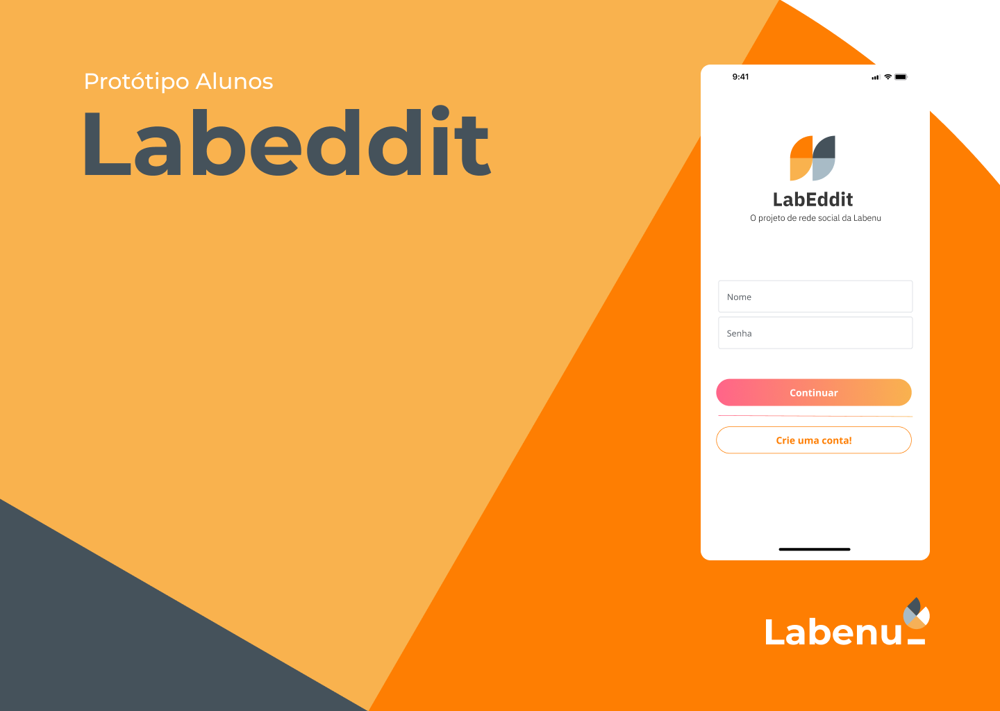
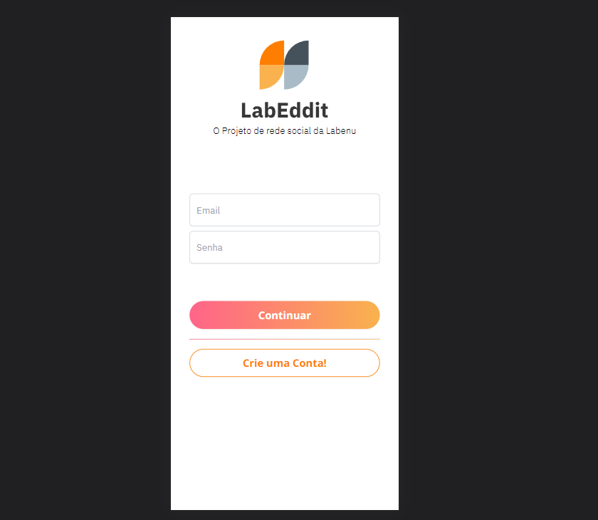
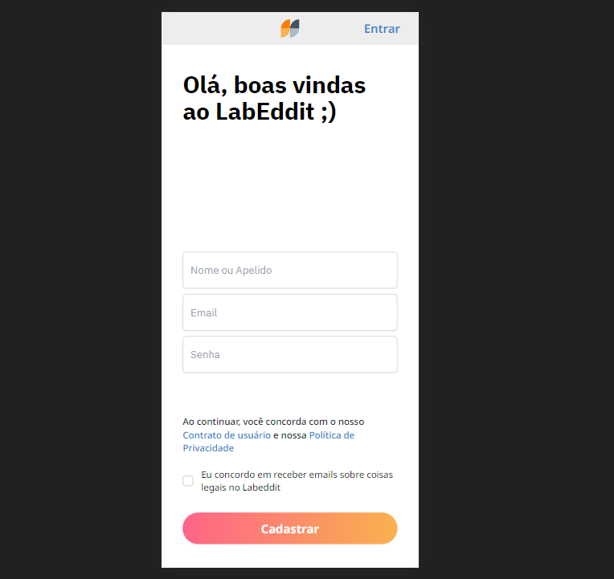
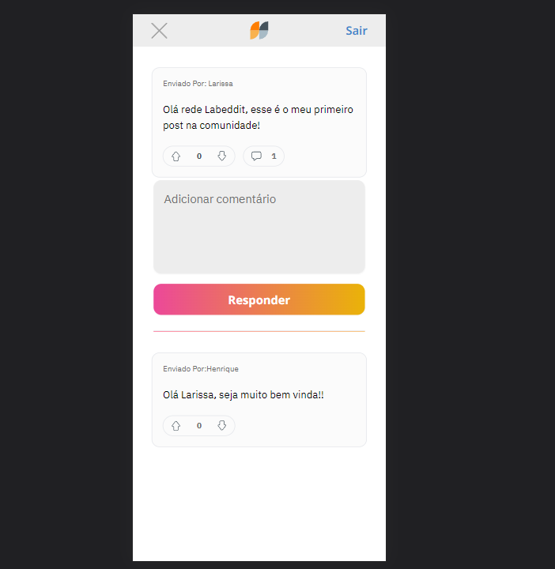

# -Labeddit - Front End -

<br><br>


## 📖 Introdução
O Labeddit é o projeto Full Stack de conclusão do bootcamp da Labenu, onde tivemos que desenvolver uma rede social fictícia usando como base o Reddit. Dividido em 2 partes (repositório Back-End e este repositório Front-End), a rede social possui um sitema de Login e Signup de usuários e as possibilidades de intereação por meio de postagens, likes e comentários. 
A aplicação Front-End foi desenvolvida com React.Js e Vite e foi utilizado do Framework TailwindCSS para fazer a estilização, que foi predefinida através de um protótipo disponibilizado no Figma da Escola.
<br>
<br>
<br>

## 🔗 Link da aplicação

- Deploy Vercel - [aqui.](https://labeddit-henrique.vercel.app/)

- Repositório de aplicação Back-End - [aqui.](https://github.com/HenriqBatista/Labeddit-Back-End)
<br>
<br>

## 👨‍💻 Desenvolvido Por:
| [<br><sub>Henrique Batista</sub>](https://github.com/HenriqBatista)|
|:---:|

<br>
<br>
<br>

## 📝 Passos para executar o Projeto em sua máquina:

```bash
# Instalando as dependências
npm install

# Executando o projeto
npm run dev

```
<br>
<br>

## 💻 Preview do Projeto
<br><sub><sub><br>

<br><sub><sub><br>

<br><sub><sub><br>

<br>
<br>

## 💻 Funcionalidades

- ### Login 
  - O usuário que já possuir contra cadastrada poderá fazer login e ter acesso as demais funcionalidades da rede social. Todas funcionalidades (Posts, Like/Dislike, Comments) são protegidas e necessitam que o usuário esteja logado para serem utilidazas.

- ### Signup
  - Permite um novo usuário cadastrar uma nova conta para ter acesso aos funcionalidades da rede social, da mesma forma que foi descrito na opção de ``Login``

- ### Funcionalidades Protegidas
  - Após efetuar um ``Login`` ou ``Signup`` o usuário terá acesso as funções de Criar uma postagem, interagir a outras postagens atraves da função Like/Dislike e fazer comentários a alguma outra postagem.

<br>
<br>
<br>

## 📚 Tecnologias & Bibliotecas utilizadas

````bash
React.Js (React Hooks, React Context, React Router)
axios
tailwindCSS
jose
cookies
universal-cookies
autoprefixer
postCSS
token JWT
````
<br>
<br>


## 💡Programas utilizados:
- VSCode
- Figma

<br>
<br>
<br>

# 📫 Contatos

📧 E-mail: henriq.batista.veloso@gmail.com

[](https://www.linkedin.com/in/henrique-batista-veloso/)

